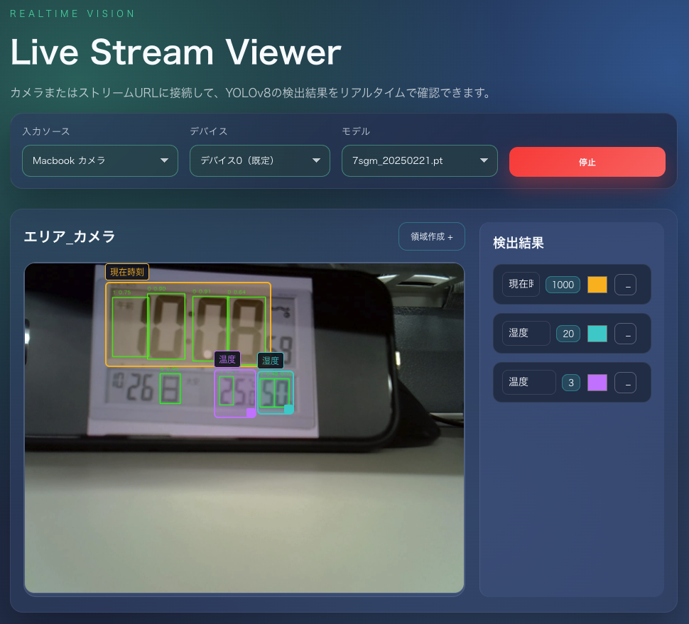

# web_server

Webカメラ/RTSP/HTTPストリームをYOLOv8で推論し、ブラウザにリアルタイム表示する物体検出アプリです。
推論領域を画面上で作成・移動・リサイズでき、領域内の検出結果を左から順に結合して表示します。



## 構成
- backend: FastAPI + OpenCV + YOLOv8
- frontend: React + Vite + WebSocket

## 起動方法

### バックエンド
```bash
cd /Users/hashimoto/vscode/test/web_server/backend
source venv/bin/activate
uvicorn main:app --reload --host 0.0.0.0 --port 5050
```

### フロントエンド
```bash
cd /Users/hashimoto/vscode/test/web_server/frontend
npm run dev
```

- フロントURL: `http://localhost:5173`
- WebSocket: `ws://localhost:5050/ws/stream`

## 使い方
1. 入力ソース（HTTP/RTSP URL または Macbookカメラ）を選択
2. `ストリーム開始` をクリック
3. `領域作成 +` で推論領域を追加
4. 赤枠をドラッグで移動、右下ハンドルでサイズ調整
5. 右側のリストに領域ごとの推論結果が表示

## 推論結果の表示ルール
- 領域内に入った検出ボックスを左端座標の昇順で並べ、ラベルを連結して表示。
- 例: "0","1" → `01`

## ドキュメント
- 仕様: `docs/spec.md`
- API仕様: `docs/api.md`
- アーキテクチャ: `docs/architecture.md`
- AI運用メモ: `docs/ai.md`

## 注意点
- YOLOv8モデル（`.pt`）は `backend/models/` に配置が必要。
- 推論領域名は重複不可。
- macOSのカメラ権限が必要な場合があります。

## ライセンス
必要に応じて追記してください。
