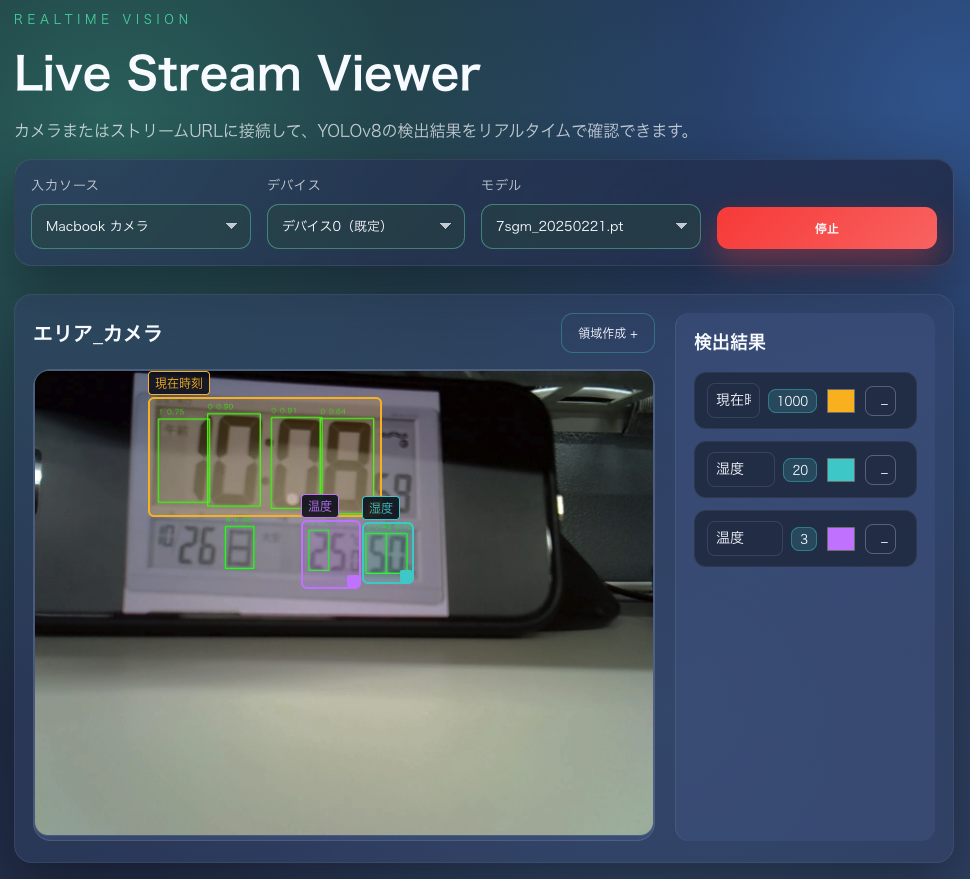

# web_server

デジタルメータ監視PoCです。  
Edge（現状は手動curl/将来は端末スクリプト）から画像を送信し、Pythonバックエンドで推論してSQLiteへ保存し、Reactダッシュボードで可視化します。  
閾値超過時はSlack Incoming Webhookへ通知します（再通知抑制あり）。



## 構成
- backend: FastAPI + OpenCV + YOLOv8 + SQLite
- frontend: React + Vite

---

## 前提
- Python仮想環境: `backend/venv`
- Node/npm: `frontend/package.json` が実行できる環境
- SQLite保存先: `backend/data/app.db`
- 受信画像保存先: `backend/data/images/YYYYMMDD/`
- Slack通知を使う場合のみ環境変数:
  - `SLACK_WEBHOOK_URL=https://hooks.slack.com/services/...`

---

## 起動手順

### 1) Backend起動（推奨: 127.0.0.1）
```bash
cd /Users/hashimoto/vscode/test/web_server/backend
source venv/bin/activate
uvicorn main:app --reload --host 127.0.0.1 --port 5050
```

別端末アクセスが必要な場合のみ `--host 0.0.0.0` を使用してください。

### 2) Frontend起動
```bash
cd /Users/hashimoto/vscode/test/web_server/frontend
npm run dev
```

### 3) ブラウザ
- `http://localhost:5173`

---

## PoCデモ手順（固定）

### 1) meters設定（LOW閾値テスト）
`dummy` 推論の `value` は `0.0` なので、`threshold_low=0.1` でLOW通知を発生させます。

```bash
curl -sS -X PUT "http://127.0.0.1:5050/api/v1/meters/default" \
  -H "Content-Type: application/json" \
  -d '{"threshold_high":9999,"threshold_low":0.1,"enabled":true}'
```

### 2) 画像送信（1回目）
```bash
curl -sS -X POST "http://127.0.0.1:5050/api/v1/images" \
  -F "image=@/Users/hashimoto/vscode/test/web_server/docs/images/推論時_20260120.png" \
  -F "meter_id=default" \
  -F "model_type=dummy"
```

期待値:
- `SLACK_WEBHOOK_URL` 設定済み: `alert_sent=true`
- `SLACK_WEBHOOK_URL` 未設定: `alert_sent=false`（送信スキップ）

### 3) すぐに再送（5分以内の再通知抑制）
同じコマンドを再実行。

期待値:
- `alert_sent=false`

### 4) enabledをfalseにして再送
```bash
curl -sS -X PUT "http://127.0.0.1:5050/api/v1/meters/default" \
  -H "Content-Type: application/json" \
  -d '{"enabled":false}'
```

その後、再度 `POST /api/v1/images` を実行。

期待値:
- `alert_sent=false`

### 5) Dashboard確認ポイント
`http://localhost:5173` の `Dashboard` タブで確認:
- 最新値一覧: `meter_id / value / ts(JST) / confidence`
- meter選択: `default` を選択して時系列グラフ表示
- 閾値設定: `threshold_high / threshold_low / enabled` を保存可能

### 6) YOLO推論での確認（任意）

YOLOモデルを使用する場合：

```bash
curl -sS -X POST "http://127.0.0.1:5050/api/v1/images" \
  -F "image=@/path/to/meter_image.png" \
  -F "meter_id=default" \
  -F "model_type=yolo"
```

---

## 開発者向けメモ
- API仕様は `docs/api.md`
- WebSocketストリーム機能（既存）も併存:
  - `ws://localhost:5050/ws/stream`
- モデル一覧:
  - `GET http://localhost:5050/models`

## Edge端末送信スクリプト

Webカメラから一定間隔でキャプチャし、`POST /api/v1/images` へ送信するスクリプトです。

- ファイル: `backend/tools/edge_sender.py`
- 依存: `opencv-python`, `requests`

### 実行例

```bash
cd /Users/hashimoto/vscode/test/web_server/backend/tools

python edge_sender.py \
  --api http://127.0.0.1:5050 \
  --meter-id default \
  --model-type yolo \
  --interval 5
````

### 主なオプション

* `--api`
  APIベースURL
  デフォルト: `http://127.0.0.1:5050`

* `--meter-id`
  送信する meter_id
  デフォルト: `default`

* `--model-type`
  使用する推論モデル
  `dummy` または `yolo`
  デフォルト: `dummy`

* `--interval`
  送信間隔（秒）
  デフォルト: `5`

* `--camera-index`
  カメラインデックス
  デフォルト: `0`

* `--timeout`
  HTTPタイムアウト秒
  デフォルト: `10`

---

## トラブルシュート（最小）

### SLACK_WEBHOOK_URL 未設定時
- 挙動: アラート判定は行うがSlack送信をスキップし、`alert_sent=false`。

### CORS / 接続先で詰まる
- 本PoCはフロントから `http://localhost:5050` へ直接アクセスします。
- バックエンド起動先ポート/ホストが異なる場合、フロントの接続先を合わせてください。
- 必要なら `VITE_API_BASE_URL`（`frontend/src/api.js`）を利用してください。

### DB確認コマンド
```bash
sqlite3 /Users/hashimoto/vscode/test/web_server/backend/data/app.db ".tables"
```
```bash
sqlite3 /Users/hashimoto/vscode/test/web_server/backend/data/app.db \
"select id,meter_id,ts,value,confidence,image_path,model_type from readings order by ts desc limit 20;"
```
```bash
sqlite3 /Users/hashimoto/vscode/test/web_server/backend/data/app.db \
"select meter_id,name,location,threshold_high,threshold_low,enabled from meters order by meter_id;"
```

---

## ドキュメント
- API仕様: `docs/api.md`
- 仕様: `docs/spec.md`
- アーキテクチャ: `docs/architecture.md`
- AI運用メモ: `docs/ai.md`

---
